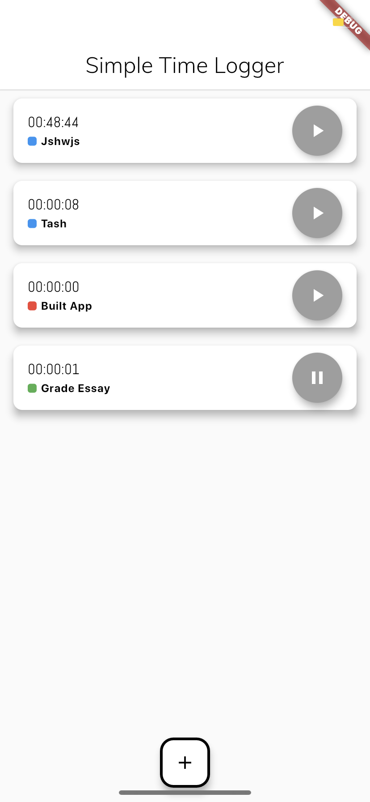
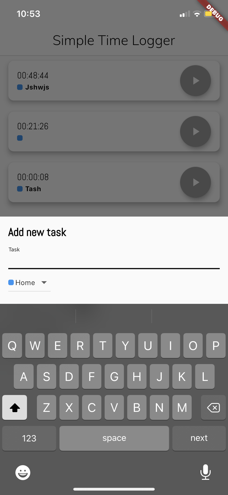
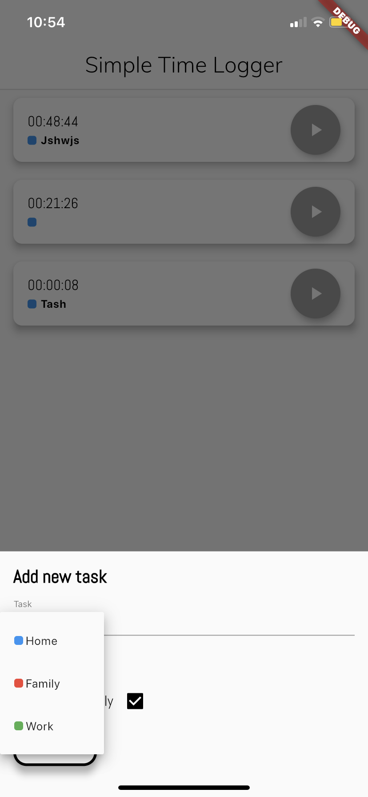
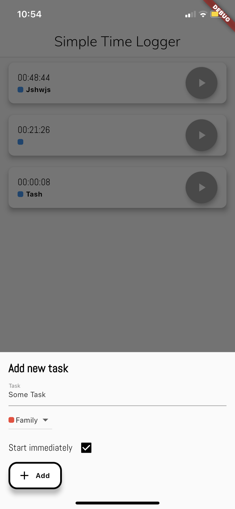

# Quick Time Logger App (Flutter)

An app that lets you have multiple stopwatch running at the same time.
Built using Google's Flutter SDK and Dart.

## Screenshots

## Homepage

## Adding new tasks
 {
    height: 50%;
    width: 50;
}

## Problems
Stopwatches don't run in real time accuracy :(